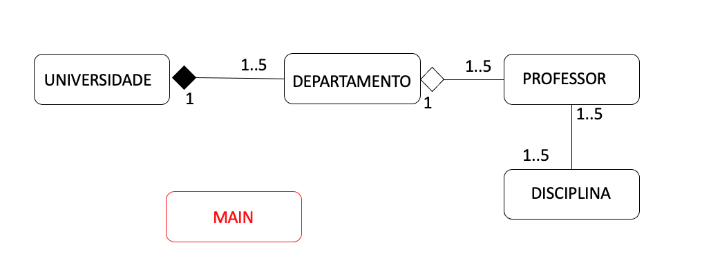

# Atividade 008: Implementar o diagrama de classes

> Ddisciplina de Laboratório de Programação de Computadores I
>
> Carlos
> 
> Daniele
> 
> Dayvson dos Santos Silva - ddss.snf19@uea.edu.br
>
> Diógeles
> 
> Elikson

### Atividade 
Utilizando a diferença entre associação, agregação e composição, codifique o diagrama de classes em anexo:
- use a referência: https://www.codeproject.com/Articles/330447/Understanding-Association-Aggregation-and-Composit

Atividade 08 da 

Utilizando a diferença entre associação, agregação e composição, codifique o diagrama de classes em anexo:
- use a referência: https://www.codeproject.com/Articles/330447/Understanding-Association-Aggregation-and-Composit

- cada classe deverá ser um arquivo .py
- muita atenção no uso dos construtores. Eles deverão obedecer a modelagem descrita no diagrama de classes
- o arquivo main.py deverá inicializar o sistema instanciando as classes
- muita atenção na ordem em que as classes deverão ser instanciadas dentro do main.py
- os .py deverão obedecer o PEP8 e não apresentar warnings ou typos

Equipe: 5 pessoas escolhidas durante a aula
Entregável: código-fonte no github

### Diagrama de classes

