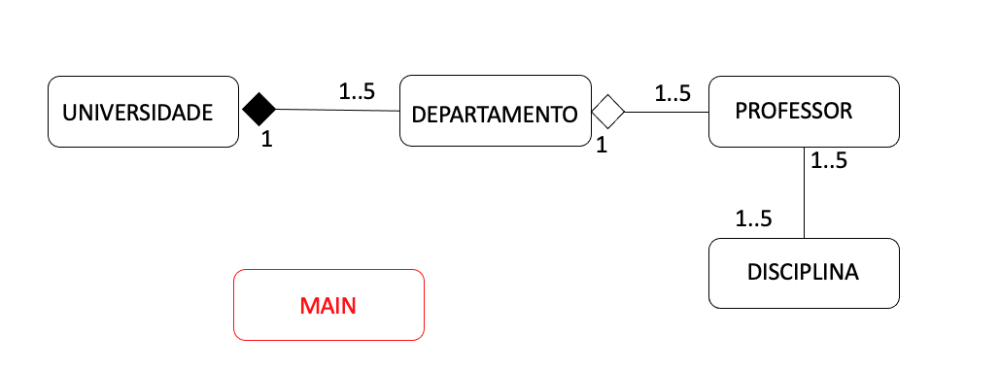

# Atividade 008: Implementar o diagrama de classes

Disciplina: Laboratório de Programação de Computadores I
> 
> Carlos Martins - cedsm.snf20@uea.edu.br
> 
> Daniele Simas - dsg.snf20@uea.edu.br
> 
> Dayvson Silva - ddss.snf19@uea.edu.br
>
> Diógeles Tamaturgo - ddst.snf20@uea.edu.br
> 
> Elikson Tavares - ebt.snf19@uea.edu.br

### Atividade

Utilizando a diferença entre associação, agregação e composição, codifique o diagrama de classes em anexo:
- use a referência: https://www.codeproject.com/Articles/330447/Understanding-Association-Aggregation-and-Composit

Utilizando a diferença entre associação, agregação e composição, codifique o diagrama de classes em anexo:
- use a referência: https://www.codeproject.com/Articles/330447/Understanding-Association-Aggregation-and-Composit

- cada classe deverá ser um arquivo .py
- muita atenção no uso dos construtores. Eles deverão obedecer a modelagem descrita no diagrama de classes
- o arquivo main.py deverá inicializar o sistema instanciando as classes
- muita atenção na ordem em que as classes deverão ser instanciadas dentro do main.py
- os .py deverão obedecer o PEP8 e não apresentar warnings ou typos

### Diagrama de classes

